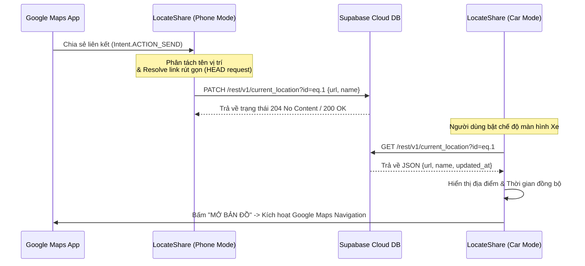
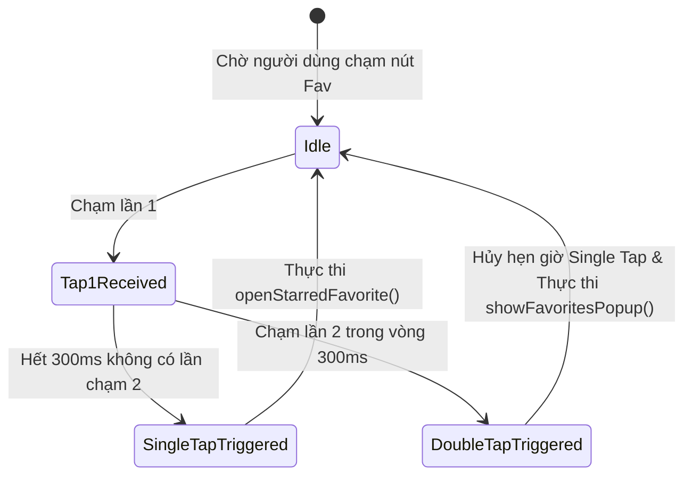
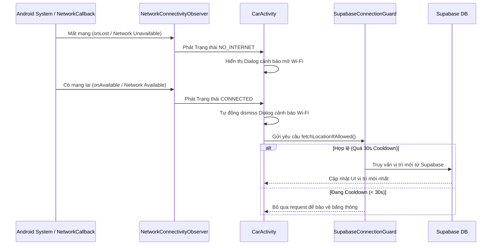

# 📍 LocateShare

**LocateShare** là một ứng dụng Android (Kotlin) hiện đại hỗ trợ chia sẻ nhanh chóng vị trí địa lý từ ứng dụng Google Maps trên điện thoại cá nhân sang màn hình Android ô tô (hoặc điện thoại phụ làm màn hình dẫn đường).

Hệ thống được thiết kế với kiến trúc đồng bộ thời gian thực thông qua **Supabase Cloud DB**, kết hợp với cơ chế quản lý kết nối mạng thông minh, xử lý cử chỉ chạm đúp (Double-tap) tối ưu cho lái xe và hỗ trợ giao diện đa hướng (Portrait & Landscape).

---

## ✨ Tính năng nổi bật

### 1. 📱 Chế độ Điện Thoại (Phone Mode - Gửi vị trí)
* **Chia sẻ 1 chạm từ Google Maps:** Chọn bất kỳ địa điểm nào trên Google Maps -> bấm **Chia sẻ (Share)** -> chọn **LocateShare**. Tọa độ và tên vị trí được gửi tức thì lên Cloud.
* **Bộ trích xuất vị trí thông minh (Smart Location Parser):**
  * Trích xuất tên vị trí sạch từ văn bản chia sẻ nhiều dòng (Multiline Text).
  * Xử lý nhãn ghim chung chung (*"Đã ghim"*, *"Dropped pin"*) bằng cách tự động kết hợp thông tin địa chỉ mô tả ở các dòng tiếp theo (Ví dụ: `Đã ghim (Gần Hải Châu, Đà Nẵng)`).
  * Xử lýURL Decode trích xuất tên địa điểm tiếng Việt có dấu chuẩn xác từ các URL chứa `/place/Tên+Vị+Trí`.
* **Giải quyết link rút gọn bất đồng bộ (Short Link Redirect Resolver):**
  * Theo vết chuyển hướng HTTP (Up to 5 Redirects) cho link dạng `maps.app.goo.gl` bằng HTTP `HEAD` request (tiết kiệm tối đa dung lượng dữ liệu 3G/4G).
  * Hiển thị Progress Bar và mô tả tiến trình theo vết URL trực quan trên giao diện.

### 2. 🚗 Chế độ Xe Hơi (Car Mode - Nhận vị trí & Dẫn đường)
* **Đồng bộ tự động & Nhận vị trí:** Tự động tải tọa độ và địa điểm mới nhất từ Supabase khi mở ứng dụng hoặc khi kết nối mạng được khôi phục.
* **Mở bản đồ điều hướng nhanh:** Nút **MỞ BẢN ĐỒ** kích hoạt thẳng ứng dụng Google Maps mặc định trên màn hình xe và bắt đầu chỉ đường.
* **Tương tác danh sách Yêu thích qua Chạm Đúp (Double-Tap Gesture):**
  * **Chạm đơn (Single Tap):** Mở ngay địa điểm mặc định được gắn sao ⭐ (*Fav of Favs* - như Nhà riêng/Công ty) trên Google Maps.
  * **Chạm đúp (Double Tap trong 300ms):** Hiển thị danh sách Popup toàn bộ địa điểm ưa thích để lựa chọn điểm đến khác.
  * *Loại bỏ hoàn toàn thao tác Nhấn giữ (Long-press)* gây mất tập trung và khó thao tác khi đang cầm lái.
* **Tự động ẩn Dialog cảnh báo Wi-Fi (Auto-Dismiss Wi-Fi Popup):**
  * Lắng nghe trạng thái kết nối mạng thời gian thực qua `NetworkConnectivityObserver`.
  * Tự động tắt Dialog nhắc nhở Wi-Fi/Internet ngay khi thiết bị có kết nối mạng trở lại mà không cần người dùng thao tác thủ công.
  * Tích hợp `SupabaseConnectionGuard` với cơ chế Cooldown (30 giây) để tránh gửi request dồn dập khi mạng chập chờn.

### 3. ⚙️ Quản lý địa điểm Yêu thích (Favorites Management)
* Thêm mới, chỉnh sửa, xóa các địa điểm thường xuyên di chuyển trong màn hình Cài đặt (`SettingsActivity`).
* Cho phép đánh dấu sao ⭐ 1 địa điểm duy nhất làm mặc định.
* Giao diện Cài đặt thích ứng linh hoạt theo hướng màn hình (Chân dung/Ngang - Portrait/Landscape) và tự động tính toán khoảng bù thanh trạng thái hệ thống (WindowInsets / Status Bar).

---

## 🔄 Luồng dữ liệu & Kiến trúc hệ thống (Data Flow & Architecture)

### 1. Luồng Gửi và Nhận vị trí hiện tại (Current Location Sharing Flow)



### 2. Luồng Xử lý Cử chỉ Chạm Đúp trên Nút Yêu Thích (Double-Tap Gesture Flow)



### 3. Luồng Tự động Ẩn Dialog Wi-Fi khi có Mạng (Auto-Dismiss Wi-Fi Dialog Flow)



---

## 🛠 Thư viện & Công nghệ (Tech Stack)

* **Language:** Kotlin 1.9+ (Target SDK 35, Min SDK 24)
* **Architecture:** Component-based event listening, State Machine, Observer Pattern
* **HTTP Client & REST API:** Retrofit 2.11.0 + OkHttp 4.12.0 + Gson Converter
* **Async & Concurrency:** Kotlin Coroutines (`Dispatchers.IO`, `Dispatchers.Main`) + Android Lifecycle Scopes
* **Database:** Supabase REST API (PostgreSQL engine với Row Level Security - RLS)
* **UI & Layouts:** Material Components, Dynamic Orientation Layouts (`layout` & `layout-land`), WindowInsets API
* **Testing:** JUnit 4, ArchTaskExecutor, Custom Deterministic Schedulers, Robolectric Layout Tests

---

## 🗄️ Cấu trúc Bảng Cơ sở dữ liệu (Supabase Schema)

### 1. Bảng `current_location`
Lưu trữ tọa độ và địa điểm hiện tại được đồng bộ từ điện thoại sang màn hình xe (cố định 1 bản ghi `id = 1`).

| Tên cột | Kiểu dữ liệu | Ràng buộc | Mô tả |
| :--- | :--- | :--- | :--- |
| `id` | `int8` | Primary Key | Cố định giá trị `1` |
| `url` | `text` | NOT NULL | Link Google Maps vị trí |
| `name` | `text` | NOT NULL | Tên vị trí đã qua xử lý |
| `updated_at` | `timestamptz` | Default `now()` | Thời gian đồng bộ cuối |

### 2. Bảng `favorite_locations`
Lưu danh sách các địa điểm ưa thích.

| Tên cột | Kiểu dữ liệu | Ràng buộc | Mô tả |
| :--- | :--- | :--- | :--- |
| `id` | `int8` | PK, Auto-Increment | Khóa chính tự tăng |
| `name` | `text` | NOT NULL | Tên hiển thị địa điểm |
| `url` | `text` | NOT NULL | Link Google Maps địa điểm |
| `is_starred` | `boolean` | Default `false` | `true` nếu là vị trí mặc định (Duy nhất 1 dòng) |
| `created_at` | `timestamptz` | Default `now()` | Ngày tạo |

---

## 🚀 Hướng dẫn Cài đặt & Thao tác

### 1. Cấu hình Supabase Key
Chỉnh sửa file `app/src/main/java/com/skul9x/locateshare/network/SupabaseConfig.kt`:
```kotlin
package com.skul9x.locateshare.network

object SupabaseConfig {
    const val BASE_URL = "https://<YOUR-PROJECT-ID>.supabase.co/rest/v1/"
    const val ANON_KEY = "<YOUR-SUPABASE-ANON-KEY>"
}
```

### 2. Biên dịch APK Debug
```bash
./gradlew assembleDebug
```
File APK kết quả nằm tại: `app/build/outputs/apk/debug/app-debug.apk`

### 3. Cài đặt trực tiếp lên thiết bị Android / Màn hình Ô tô qua ADB
```bash
adb install -r app/build/outputs/apk/debug/app-debug.apk
```

---

## 🧪 Hệ thống Kiểm thử (Verification & Test Suite)

Dự án bao gồm bộ kiểm thử **69 Test cases** bảo đảm tính ổn định tuyệt đối không có regression:

* **Chạy toàn bộ Test suite (Offline & Layout Tests):**
  ```bash
  ./gradlew test
  ```
* **Danh sách các bộ kiểm thử chính:**
  * `DoubleTapHandlerTest`: Kiểm thử cử chỉ chạm đơn, chạm đúp, chạm chậm, chạm ba lần và hủy timer.
  * `CarActivityFavoritesInteractionTest`: Kiểm thử tích hợp chạm đúp trên CarActivity.
  * `CarActivityAutoDismissWifiTest`: Kiểm thử tự động ẩn popup Wi-Fi và quản lý dialog.
  * `CarActivitySupabaseConnectionFailureTest`: Kiểm thử xử lý lỗi kết nối Supabase.
  * `NetworkConnectivityObserverTest`: Kiểm thử phát hiện thay đổi mạng thực tế và fallback.
  * `NetworkUtilsTest`: Kiểm thử helper kiểm tra trạng thái mạng.
  * `LocationParserTest`: Kiểm thử trích xuất tên địa điểm và theo vết redirect link ngắn.
  * `CarLayoutXmlTest` / `SettingsLandscapeLayoutTest` / `SettingsPortraitLayoutTest`: Kiểm thử giao diện và cấu trúc XML.

---

## 📄 Bản quyền (License)

Copyright © 2026 Nguyễn Duy Trường (skul9x). Released under the MIT License.
