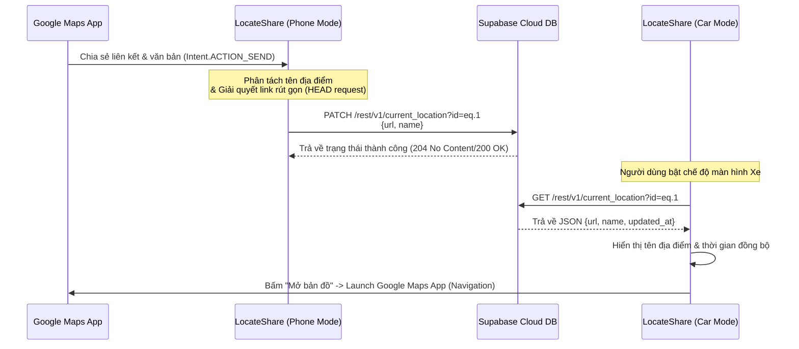
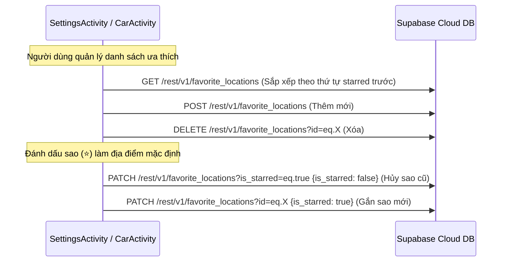

# 📍 LocateShare

**LocateShare** là một ứng dụng Android (Kotlin) hữu ích hỗ trợ chia sẻ nhanh chóng liên kết vị trí từ Google Maps từ điện thoại cá nhân xuống màn hình Android trên ô tô (hoặc một chiếc điện thoại khác được đặt làm màn hình phụ dẫn đường).

Hệ thống đã được nâng cấp toàn diện từ kiến trúc PHP Backend truyền thống lên **Supabase Cloud DB**, giúp đồng bộ hóa thời gian thực (realtime) dữ liệu vị trí và quản lý kho địa điểm yêu thích (Favorites) một cách an toàn, mượt mà mà không lo về giới hạn của hosting miễn phí hay lỗi challenge cookie.

---

## ✨ Tính năng nổi bật

### 1. 📱 Chế độ Điện Thoại (Phone Mode - Gửi vị trí)
* **Chia sẻ tức thì:** Mở app Google Maps trên điện thoại, chọn một địa điểm bất kỳ, bấm **Chia sẻ (Share)** và chọn **LocateShare**. Link và tên địa điểm sẽ tự động đồng bộ lên Supabase Cloud ngay lập tức.
* **Bộ tách tên thông minh (Smart Location Parser):** 
  * Tự động trích xuất tên địa điểm sạch từ đoạn văn bản chia sẻ nhiều dòng (Multiline Text) của Google Maps.
  * Tự động xử lý các nhãn ghim chung chung (như *"Đã ghim"*, *"Dropped pin"*) bằng cách gộp với thông tin địa chỉ mô tả ở dòng tiếp theo (Ví dụ: `Đã ghim (Gần Hải Châu, Đà Nẵng)`).
  * Giải mã (URL Decode) các liên kết bản đồ đầy đủ dạng `/place/Tên+Vị+Trí` để lấy ra tên địa điểm tiếng Việt có dấu chuẩn xác.
* **Trình giải quyết Link rút gọn (Short Link Redirect Resolver):** 
  * Khi chia sẻ link rút gọn `maps.app.goo.gl` (không chứa sẵn tên địa điểm), ứng dụng sẽ thực hiện request `HEAD` bất đồng bộ (giúp tiết kiệm tối đa băng thông so với request `GET`) để theo vết chuyển hướng (HTTP Redirects) lên đến 5 lần.
  * Trích xuất tên địa điểm từ đường dẫn URL đích cuối cùng trước khi gửi lên cơ sở dữ liệu.
  * Hiển thị thanh tiến trình (Progress Bar) và thông tin trạng thái phân tách link trực quan trên màn hình gửi.

### 2. 🚗 Chế độ Xe Hơi (Car Mode - Nhận vị trí)
* **Tự động tải vị trí:** Tự động lấy thông tin tọa độ và tên địa điểm mới nhất từ Supabase khi mở màn hình hoặc bấm **Tải lại (Reload)**.
* **Mở bản đồ một chạm:** Bấm nút **MỞ BẢN ĐỒ** để khởi chạy ngay ứng dụng Google Maps mặc định trên màn hình xe và bắt đầu điều hướng.
* **Quản lý danh sách ưa thích nhanh:**
  * **Chạm nhanh (Single Tap):** Mở bản đồ trực tiếp đi tới địa điểm được đánh sao mặc định (⭐ Fav of Favs) - thường là địa chỉ Nhà riêng hoặc Công ty của bạn.
  * **Ấn giữ (Long Press):** Hiển thị danh sách Popup toàn bộ địa điểm ưa thích đã lưu để chọn nhanh điểm đến khác.

### 3. ⚙️ Quản lý địa điểm yêu thích (Favorites Management)
* Cho phép thêm mới, cập nhật, xóa các địa điểm thường xuyên di chuyển ngay trong màn hình Cài đặt.
* Gắn sao ⭐ cho một địa điểm mặc định duy nhất để tối ưu thao tác khi đang lái xe.

---

## 🔄 Luồng dữ liệu (Data Flow)

### Luồng gửi và nhận địa điểm (Current Location Flow)



### Luồng quản lý địa điểm ưa thích (Favorites Flow)



---

## 🛠 Tech Stack

* **Ngôn ngữ phát triển:** Kotlin (Android 7.0+ / SDK 24+)
* **Kết nối API & HTTP Client:** Retrofit2 + OkHttp3 + Gson (Hỗ trợ cấu hình Headers động: API Key, Bearer Token)
* **Xử lý bất đồng bộ:** Kotlin Coroutines (Dispatchers.IO) + Lifecycle Scope (`lifecycleScope`)
* **Kiến trúc cơ sở dữ liệu:** Supabase REST API (PostgreSQL engine với Row Level Security - RLS)
* **Unit Testing:** JUnit 4 + Kotlin Coroutines Test Library

---

## 🗂 Cấu trúc thư mục mã nguồn

```
LocateShare-main/
├── app/
│   ├── src/
│   │   ├── main/
│   │   │   ├── AndroidManifest.xml       # Cấu hình app, Intents filter, Permissions
│   │   │   └── java/com/skul9x/locateshare/
│   │   │       ├── MainActivity.kt       # Màn hình chính, cấu hình tự động điều hướng
│   │   │       ├── PhoneActivity.kt      # Xử lý nhận share link, phân tích và gửi lên Cloud
│   │   │       ├── CarActivity.kt        # Màn hình xe, tự động fetch và hiển thị địa điểm nhận
│   │   │       ├── SettingsActivity.kt   # Quản lý danh sách favorites
│   │   │       │
│   │   │       ├── network/
│   │   │       │   ├── ApiService.kt     # Khai báo cấu trúc API, Retrofit Client & Interceptors
│   │   │       │   └── SupabaseConfig.kt # Chứa BASE_URL và ANON_KEY kết nối tới Supabase
│   │   │       │
│   │   │       └── util/
│   │   │           └── LocationParser.kt # Thư viện phân tách địa chỉ và xử lý redirect link
│   │   │
│   │   └── test/java/com/skul9x/locateshare/
│   │       ├── util/
│   │       │   └── LocationParserTest.kt # Unit tests cho parser và redirect resolver
│   │       └── network/
│   │           └── SupabaseIntegrationTest.kt # Integration tests kết nối trực tiếp Supabase API
│   │
│   └── build.gradle.kts                  # Cấu hình các dependencies và SDK của app
└── settings.gradle.kts
```

---

## 🗄️ Cấu trúc bảng trên Supabase Database

Để dự án hoạt động chính xác, bạn cần khởi tạo 2 bảng sau trên Supabase Dashboard:

### 1. Bảng `current_location`
Lưu trữ tọa độ hiện thời được đồng bộ từ điện thoại.
* **Quy tắc:** Chỉ chứa duy nhất 1 bản ghi có `id = 1`.

| Tên cột | Kiểu dữ liệu | Mô tả |
| :--- | :--- | :--- |
| `id` | `int8` (Primary Key) | Giá trị mặc định: `1` (cố định) |
| `url` | `text` | Link liên kết Google Maps của địa điểm |
| `name` | `text` | Tên địa điểm đã được phân tách sạch |
| `updated_at` | `timestamptz` | Tự động cập nhật thời gian (`now()`) |

### 2. Bảng `favorite_locations`
Lưu trữ danh sách các điểm ưa thích thường xuyên ghé thăm.

| Tên cột | Kiểu dữ liệu | Mô tả |
| :--- | :--- | :--- |
| `id` | `int8` (Primary Key, Auto-Increment) | Khóa chính tự tăng |
| `name` | `text` | Tên vị trí (Ví dụ: Nhà riêng, Công ty...) |
| `url` | `text` | Link Google Maps tương ứng |
| `is_starred` | `boolean` | `true` nếu là địa điểm mặc định (chỉ duy nhất 1 điểm) |
| `created_at` | `timestamptz` | Tự động ghi nhận thời gian tạo (`now()`) |

---

## 🚀 Hướng dẫn cài đặt và cấu hình nhanh

### Bước 1: Cấu hình API Supabase
Mở file [SupabaseConfig.kt](file:///d:/skul9x/LocateShare-main/app/src/main/java/com/skul9x/locateshare/network/SupabaseConfig.kt) và điền thông tin dự án Supabase của bạn:
```kotlin
package com.skul9x.locateshare.network

object SupabaseConfig {
    const val BASE_URL = "https://<PROJECT-ID>.supabase.co/rest/v1/"
    const val ANON_KEY = "<YOUR-SUPABASE-ANON-KEY>"
}
```

### Bước 2: Build dự án
Mở terminal tại thư mục gốc của dự án và build file APK debug bằng Gradle:
```powershell
.\gradlew assembleDebug
```
*File APK đầu ra sẽ được tạo tại:* `app/build/outputs/apk/debug/app-debug.apk`

### Bước 3: Cài đặt lên điện thoại/màn hình xe
Đảm bảo thiết bị của bạn đã được kết nối với máy tính qua cáp USB và đã bật **Gỡ lỗi USB (USB Debugging)**. Chạy lệnh sau để cài đặt trực tiếp:
```powershell
adb install -r app\build\outputs\apk\debug\app-debug.apk
```

---

## 🧪 Chạy Kiểm thử (Testing)

Dự án được viết sẵn bộ test bao phủ toàn bộ các tính năng cốt lõi:

* **Chạy tất cả Unit Tests (Offline):** Kiểm tra khả năng tách chuỗi văn bản và định dạng địa điểm.
  ```powershell
  .\gradlew test
  ```
* **Chạy Integration Tests (Kết nối trực tiếp mạng thật):** Thực hiện kiểm thử CRUD lên bảng Supabase thật để xác nhận luồng dữ liệu thông suốt.
  ```powershell
  .\gradlew test --tests "com.skul9x.locateshare.network.SupabaseIntegrationTest"
  ```

---
*Dự án được thiết kế mã nguồn mở, phục vụ nhu cầu tối ưu trải nghiệm lái xe cá nhân.*

---

## 📄 Bản quyền (License)

Copyright {this_year} Nguyễn Duy Trường

