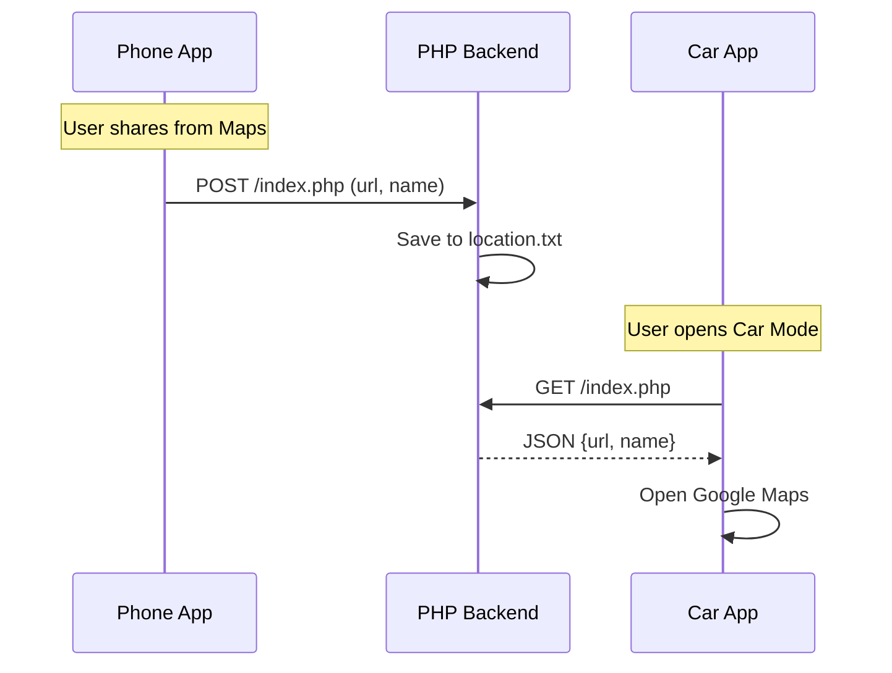

# 📁 Project Structure

```
LocateShare-main/
├── backend/
│   ├── index.php             # Xử lý lưu/đọc địa điểm (API)
│   └── location.txt          # File lưu trữ dữ liệu tạm thời
│
├── app/
│   ├── src/main/
│       ├── AndroidManifest.xml
│       └── java/com/skul9x/locateshare/
│           │
│           ├── MainActivity.kt       # Màn hình chính & Cấu hình
│           ├── PhoneActivity.kt      # Chế độ Gửi (Phone)
│           ├── CarActivity.kt        # Chế độ Nhận (Car)
│           │
│           └── network/
│               ├── ApiService.kt     # Retrofit Interface & Client
│               └── HostingVerifier.kt # Xử lý xác thực Host (WebView)
│
├── build.gradle.kts          # App dependencies
└── settings.gradle.kts
```

## 🔄 Data Flow



## 🔐 Authentication Flow (Free Hosting)

1. **Check Cookie:** App kiểm tra xem đã có cookie `__test` trong SharedPreferences chưa.
2. **Missing/Expired:** Nếu chưa có hoặc request lỗi 403/JavaScript Challenge:
   - `HostingVerifier` mở WebView ẩn (hoặc dialog).
   - Load trang web để chạy JS của nhà mạng.
   - Lấy cookie `__test` thành công.
3. **Save:** Lưu cookie vào `SharedPreferences` thông qua `RetrofitClient.saveCookie()`.
4. **Request:** Đính kèm cookie vào header của mọi request Retrofit.

## 🧩 Key Components

- **RetrofitClient:** Quản lý kết nối HTTP, tự động thêm Header `Cookie` và `User-Agent`.
- **HostingVerifier:** Class tiện ích giúp bypass màn hình bảo vệ của các hosting miễn phí like `free.nf`.
- **PhoneActivity:** Xử lý `ACTION_SEND` intent để nhận text từ ứng dụng khác (Google Maps).
